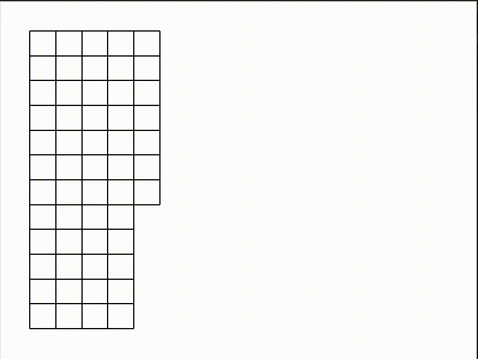

# Maze Runner

This is a program written in python using tkinter to generate and solve mazes.

Here is a demonstration of the maze: 

To traverse the maze, I used DFS. If it had more than one selection, I took advantage of the random library. 

To build this locally, you have to clone the repository and run [main.py](src/main.py), assuming you have the required libraries set up.

I will be working on more complex projects in the future. Tune in!